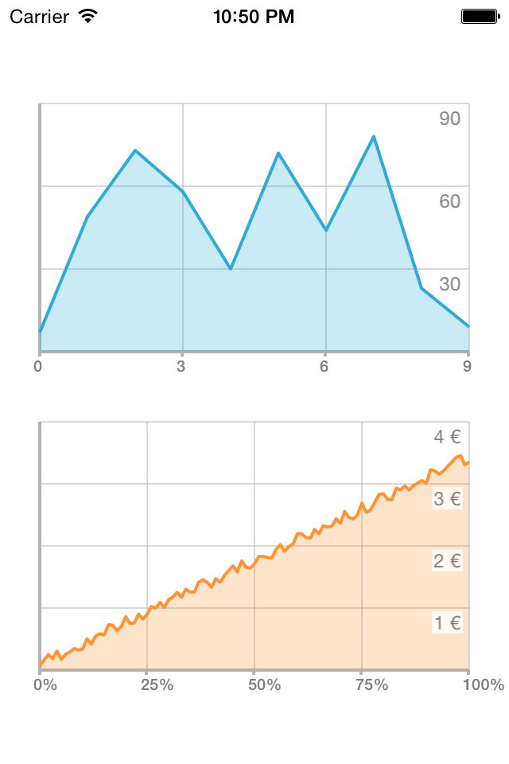
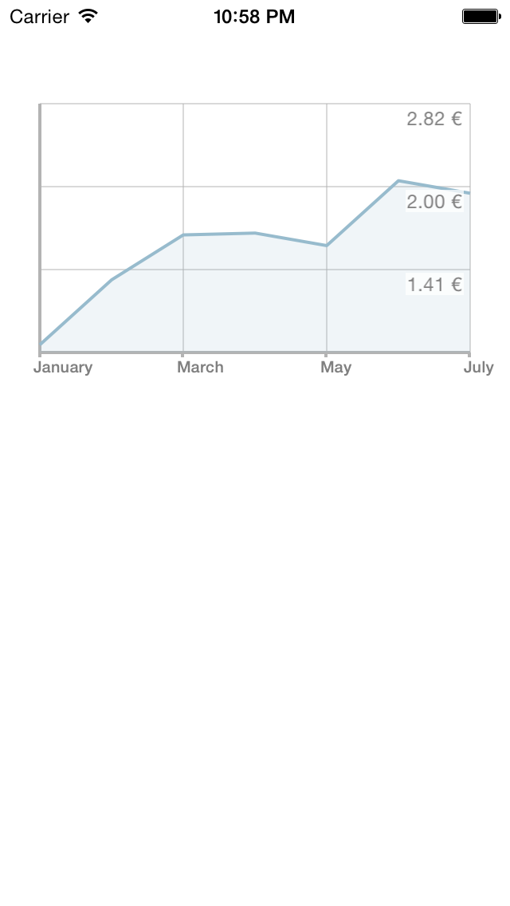

FSLineChart
===========

A line chart library for iOS.

Screenshots
---
&nbsp;


Installing FSLineChart
---
Add the contents of the FSLineChart project to your directory or simply add the following line to your Podfile:

    pod "FSLineChart"

How to use
---
FSLineChart is a subclass of UIView so it can be added as regular view. The block structure allows you to format the values displayed on the chart the way you want. Here is a simple example:

```objc
NSArray* months = @[@"January", @"February", @"March", @"April", @"May", @"June", @"July"];
    
FSLineChart* lineChart = [[FSLineChart alloc] initWithFrame:CGRectMake(20, 260, [UIScreen mainScreen].bounds.size.width - 40, 166)];

lineChart.labelForIndex = ^(NSUInteger item) {
    return months[item];
};

lineChart.labelForValue = ^(CGFloat value) {
    return [NSString stringWithFormat:@"%.02f €", powf(10,value)];
};

[lineChart setChartData:chartData];
```

You can also set several parameters. Some of the parameters including `color` and `fillColor` must be set before calling the `setChartData` method. All those properties are available:

```objc
// Index label properties
@property (copy) FSLabelForIndexGetter labelForIndex;
@property (nonatomic, strong) UIFont* indexLabelFont;
@property (nonatomic) UIColor* indexLabelTextColor;
@property (nonatomic) UIColor* indexLabelBackgroundColor;

// Value label properties
@property (copy) FSLabelForValueGetter labelForValue;
@property (nonatomic, strong) UIFont* valueLabelFont;
@property (nonatomic) UIColor* valueLabelTextColor;
@property (nonatomic) UIColor* valueLabelBackgroundColor;
@property (nonatomic) ValueLabelPositionType valueLabelPosition;

// Number of visible step in the chart
@property (nonatomic) int gridStep;
@property (nonatomic) int verticalGridStep;
@property (nonatomic) int horizontalGridStep;

// Margin of the chart
@property (nonatomic) CGFloat margin;

@property (nonatomic) CGFloat axisWidth;
@property (nonatomic) CGFloat axisHeight;

// Decoration parameters, let you pick the color of the line as well as the color of the axis
@property (nonatomic, strong) UIColor* axisColor;
@property (nonatomic) CGFloat axisLineWidth;

// Chart parameters
@property (nonatomic, strong) UIColor* color;
@property (nonatomic, strong) UIColor* fillColor;
@property (nonatomic) CGFloat lineWidth;

// Data points
@property (nonatomic) BOOL displayDataPoint;
@property (nonatomic, strong) UIColor* dataPointColor;
@property (nonatomic, strong) UIColor* dataPointBackgroundColor;
@property (nonatomic) CGFloat dataPointRadius;

// Grid parameters
@property (nonatomic) BOOL drawInnerGrid;
@property (nonatomic, strong) UIColor* innerGridColor;
@property (nonatomic) CGFloat innerGridLineWidth;

// Smoothing
@property (nonatomic) BOOL bezierSmoothing;
@property (nonatomic) CGFloat bezierSmoothingTension;

// Animations
@property (nonatomic) CGFloat animationDuration;
```


Examples
---
You can clone the repo to see a simple example. I'm also using FSLineChart on [ChartLoot](https://github.com/ArthurGuibert/ChartLoot) if you want to see the integration in a bigger project.
